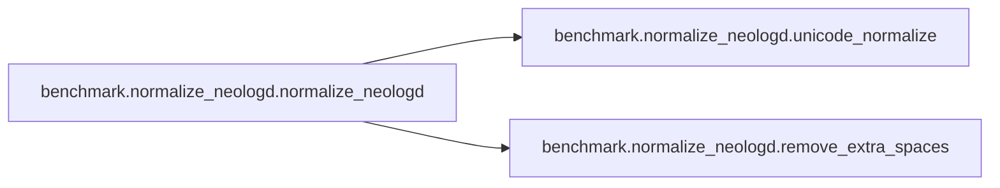

# Benchmark Normalize Neologd

[_Documentation generated by Documatic_](https://www.documatic.com)

<!---Documatic-section-Codebase Structure-start--->
## Codebase Structure

<!---Documatic-block-system_architecture-start--->
```mermaid
None
```
<!---Documatic-block-system_architecture-end--->

# #
<!---Documatic-section-Codebase Structure-end--->

<!---Documatic-section-benchmark.normalize_neologd.unicode_normalize-start--->
## benchmark.normalize_neologd.unicode_normalize

<!---Documatic-section-unicode_normalize-start--->
<!---Documatic-block-benchmark.normalize_neologd.unicode_normalize-start--->
<details>
	<summary><code>benchmark.normalize_neologd.unicode_normalize</code> code snippet</summary>

```python
def unicode_normalize(cls, s):
    pt = re.compile('([{}]+)'.format(cls))

    def norm(c):
        return unicodedata.normalize('NFKC', c) if pt.match(c) else c
    s = ''.join((norm(x) for x in re.split(pt, s)))
    return s
```
</details>
<!---Documatic-block-benchmark.normalize_neologd.unicode_normalize-end--->
<!---Documatic-section-unicode_normalize-end--->

# #
<!---Documatic-section-benchmark.normalize_neologd.unicode_normalize-end--->

<!---Documatic-section-benchmark.normalize_neologd.remove_extra_spaces-start--->
## benchmark.normalize_neologd.remove_extra_spaces

<!---Documatic-section-remove_extra_spaces-start--->
<!---Documatic-block-benchmark.normalize_neologd.remove_extra_spaces-start--->
<details>
	<summary><code>benchmark.normalize_neologd.remove_extra_spaces</code> code snippet</summary>

```python
def remove_extra_spaces(s):
    s = re.sub('[ \u3000]+', ' ', s)
    blocks = ''.join(('一-\u9fff', '\u3040-ゟ', '゠-ヿ', '\u3000-〿', '\uff00-\uffef'))
    basic_latin = '\x00-\x7f'

    def remove_space_between(cls1, cls2, s):
        p = re.compile('([{}]) ([{}])'.format(cls1, cls2))
        while p.search(s):
            s = p.sub('\\1\\2', s)
        return s
    s = remove_space_between(blocks, blocks, s)
    s = remove_space_between(blocks, basic_latin, s)
    s = remove_space_between(basic_latin, blocks, s)
    return s
```
</details>
<!---Documatic-block-benchmark.normalize_neologd.remove_extra_spaces-end--->
<!---Documatic-section-remove_extra_spaces-end--->

# #
<!---Documatic-section-benchmark.normalize_neologd.remove_extra_spaces-end--->

<!---Documatic-section-benchmark.normalize_neologd.normalize_neologd-start--->
## benchmark.normalize_neologd.normalize_neologd

<!---Documatic-section-normalize_neologd-start--->


### Object Calls

* benchmark.normalize_neologd.unicode_normalize
* benchmark.normalize_neologd.remove_extra_spaces

<!---Documatic-block-benchmark.normalize_neologd.normalize_neologd-start--->
<details>
	<summary><code>benchmark.normalize_neologd.normalize_neologd</code> code snippet</summary>

```python
def normalize_neologd(s):
    s = s.strip()
    s = unicode_normalize('０−９Ａ-Ｚａ-ｚ｡-ﾟ', s)

    def maketrans(f, t):
        return {ord(x): ord(y) for (x, y) in zip(f, t)}
    s = s.translate(maketrans('!"#$%&\'()*+,-./:;<=>?@[\\]^_`{|}~｡､･｢｣', '！”＃＄％＆’（）＊＋，−．／：；＜＝＞？＠［￥］＾＿｀｛｜｝〜。、・「」'))
    s = re.sub('[˗֊‐‑‒–⁃⁻₋−]+', '-', s)
    s = re.sub('[﹣－ｰ—―─━ー]+', 'ー', s)
    s = re.sub('[~∼∾〜〰～]', '', s)
    s = remove_extra_spaces(s)
    s = unicode_normalize('！”＃＄％＆’（）＊＋，−．／：；＜＞？＠［￥］＾＿｀｛｜｝〜', s)
    return s
```
</details>
<!---Documatic-block-benchmark.normalize_neologd.normalize_neologd-end--->
<!---Documatic-section-normalize_neologd-end--->

# #
<!---Documatic-section-benchmark.normalize_neologd.normalize_neologd-end--->

[_Documentation generated by Documatic_](https://www.documatic.com)